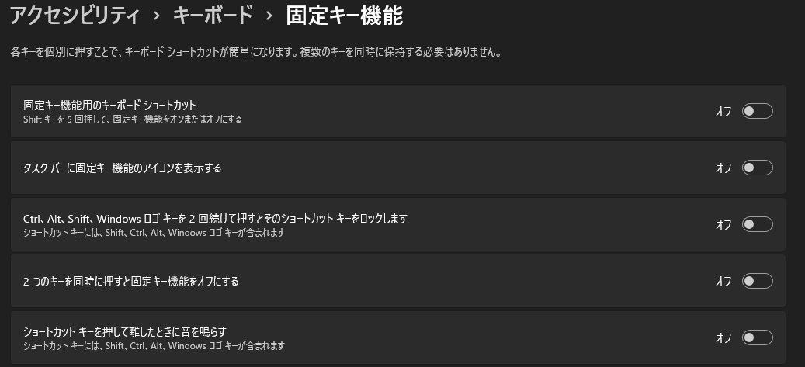

# Windows Setup Memo

自分用メモ。


## `C:\Personal`

+ [keyhac](https://sites.google.com/site/craftware/keyhac-ja)
+ `launch.yaml`
+ フォント
    + [IBM-Plex-Sans](https://github.com/IBM/plex/releases)
    + [HackGen](https://github.com/yuru7/HackGen/releases)
    + [InGenUI](https://github.com/yuru7/InGenUI/releases)
    + [PlemolJP](https://github.com/yuru7/PlemolJP/releases)
    + [UDEVGothic](https://github.com/yuru7/udev-gothic/releases)

## setup

1. [Firefox](https://www.mozilla.org/ja/firefox/new/)
    + 最終タブで閉じないようにする
        + `about:config` → `browser.tabs.closeWindowWithLastTab` を `false` に
1. [Chrome](https://www.google.com/intl/ja/chrome/)
1. [Dropbox](https://www.dropbox.com/home)
1. [Google日本語入力](https://www.google.co.jp/ime/)
1. [Mery](https://www.haijin-boys.com/)
1. [ThunderBird](https://www.thunderbird.net/ja/)
    + `C:\Users\USER\AppData\Roaming\Thunderbird` （ `$env:APPDATA|Join-Path -ChildPath "thunderbird"` ）をコピー
    + add-ons
        + [Confirm-Address](https://addons.thunderbird.net/ja/thunderbird/user/meatian/)
        + [tbkeys-lite](https://addons.thunderbird.net/ja/thunderbird/user/willssss/)
        + [No Message Pane Sort](https://addons.thunderbird.net/ja/thunderbird/addon/no-message-pane-sort-by-mouse/)
1. [SumatraPDF](https://www.sumatrapdfreader.org/download-free-pdf-viewer)
    + インストール時は `オプション` → `すべてのユーザーに対してインストール`
1. [pwsh](https://github.com/PowerShell/PowerShell/releases)
    1. `Get-ExecutionPolicy` → `RemoteSigned` でなければ管理者権限で `Set-ExecutionPolicy RemoteSigned`
    1.  `.\src\copy_google_ime.ps1`
        + Dropbox 内の `config1.db` と `user_dictionary.db` を `C:\Users\USER\AppData\LocalLow\Google\Google Japanese Input` にコピーする
        + 2回目以降は PowerShell で同期するので不要
    1. `.\src\pwsh.ps1`
    1. `.\src\keyhac.ps1`
    1. `.\src\mery.ps1`
    1. `.\src\mousegesuturel.ps1`
    1. `.\src\sumatrapdf.ps1`
    1. `.\src\thunderbird.ps1`

## scoop

```
Invoke-Expression (New-Object System.Net.WebClient).DownloadString('https://get.scoop.sh')
```

```
scoop bucket add extras
```

## Windows11 システム設定

### キーボード設定変更キー（alt+shift）の無効化


### 固定キーの無効化



### プリインストールアプリの削除

+ `アプリと機能` から不要なゲームアプリなどを削除
+ `オプション機能` から不要な機能を削除


