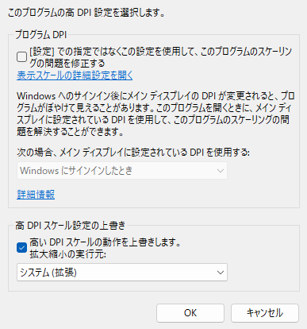

# Windows Setup Memo

## favorite fonts

+ [IBM-Plex-Sans](https://github.com/IBM/plex/releases)
+ [HackGen](https://github.com/yuru7/HackGen/releases)
+ [InGenUI](https://github.com/yuru7/InGenUI/releases)
+ [PlemolJP](https://github.com/yuru7/PlemolJP/releases)
+ [UDEVGothic](https://github.com/yuru7/udev-gothic/releases)

## setup

1. [Firefox](https://www.mozilla.org/ja/firefox/new/) ([config](./app_config/firefox.md))
1. [Chrome](https://www.google.com/intl/ja/chrome/)
1. [Dropbox](https://www.dropbox.com/home)
1. [Google日本語入力](https://www.google.co.jp/ime/)
1. [Mery](https://www.haijin-boys.com/)
1. [ThunderBird](https://www.thunderbird.net/ja/)
1. [SumatraPDF](https://www.sumatrapdfreader.org/download-free-pdf-viewer)
    + インストール時は `オプション` → `すべてのユーザーに対してインストール`
1. [pwsh](https://github.com/PowerShell/PowerShell/releases)
    1. `Get-ExecutionPolicy` の結果が `RemoteSigned` でなければ管理者権限で `Set-ExecutionPolicy RemoteSigned`
    1.  初回のみ `.\src\copy_google_ime.ps1` を実行して Dropbox 内の `config1.db` と `user_dictionary.db` を `C:\Users\USER\AppData\LocalLow\Google\Google Japanese Input` にコピーする
    1. 下記スクリプトを実行してセットアップ
        + `.\src\pwsh.ps1`
        + `.\src\keyhac.ps1`
        + `.\src\mery.ps1`
        + `.\src\mousegesuturel.ps1`
        + `.\src\sumatrapdf.ps1`

## scoop

```
Invoke-Expression (New-Object System.Net.WebClient).DownloadString('https://get.scoop.sh')
```

```
scoop bucket add extras
```

## Windows11 システム設定

### パフォーマンスオプション


+ `スクリーンフォントの縁を滑らかにする` と `アイコンの代わりに縮小版を表示する` 以外はオフでOK。
+ 必要であれば `ドラッグ中にウィンドウの内容を表示する` もオンに。

### キーボード設定変更キー（alt+shift）の無効化


### 固定キーの無効化


### 高DPI設定時の対応



`高 DPI スケール設定の上書き` で `システム（拡張）` を設定しておけばよい様子。

+ `アプリケーション` はアプリ自体の本来の描画で調整なしの状態
+ `システム` だとぼやけることがある

ただし MouseGestureL はここで `アプリケーション` を指定する（[公式](http://hp.vector.co.jp/authors/VA018351/mglahk.html)）。

> AutoHotkeyはPer-Monitor DPIに対応していないため、マルチモニター環境でプライマリモニターとは異なる表示スケールが設定されたモニター上では、カーソル座標に関連した不具合が発生します。 これを回避するには、以下の手順でAutoHotkeyに対する高DPI設定を変更する必要があります。
> 
>     1. エクスプローラーでAutoHotkey.exe（またはMouseGestureL.exe）のプロパティを表示する。
>     2. 「互換性」タブを選択し、「設定」の中の「高DPI設定の変更」ボタンをクリックする。
>     3. 「高DPIスケール設定の上書き」の中の「高DPIスケール設定の動作を上書きします。」をチェックする。
>     4. 「拡大縮小の実行元」ドロップダウンリストで「アプリケーション」を選択する。（デフォルトで選択されています）
>     5. 「OK」ボタンをクリックしてプロパティ画面を閉じる。
> 
> 上記の設定変更によりサブモニター上でのジェスチャー機能は正常動作するようになりますが、設定画面等のダイアログBOXをサブモニターへ移動した際に、表示スケールに応じたウィンドウサイズの自動調節が行われなくなります。

### プリインストールアプリの削除

+ `アプリと機能` から不要なゲームアプリなどを削除
+ `オプション機能` から不要な機能を削除


#### ストアアプリ等の強制削除

https://winaero.com/windows-11-uninstall-preinstalled-apps/#Uninstall_apps_from_the_Start_menu

|App|Removal command|
|:---|:---|
|AV1 Codec| `Get-AppxPackage *AV1VideoExtension* \| Remove-AppxPackage` |
|News app| `Get-AppxPackage *BingNews* \| Remove-AppxPackage` |
|Weather| `Get-AppxPackage *BingWeather* \| Remove-AppxPackage` |
|PowerShell| `Get-AppxPackage *PowerShell* \| Remove-AppxPackage` |
|WebP image support| `Get-AppxPackage *WebpImageExtension* \| Remove-AppxPackage` |
|HEIF image support| `Get-AppxPackage *HEIFImageExtension* \| Remove-AppxPackage` |
|Windows Terminal| `Get-AppxPackage *WindowsTerminal* \| Remove-AppxPackage` |
|Music app| `Get-AppxPackage *ZuneMusic* \| Remove-AppxPackage` |
|Movies and TV| `Get-AppxPackage *ZuneVideo* \| Remove-AppxPackage` |
|MS Office| `Get-AppxPackage *MicrosoftOfficeHub* \| Remove-AppxPackage` |
|People app| `Get-AppxPackage *People* \| Remove-AppxPackage` |
|Maps| `Get-AppxPackage *WindowsMaps* \| Remove-AppxPackage` |
|Help and tips| `Get-AppxPackage *GetHelp* \| Remove-AppxPackage` |
|Voice Recorder| `Get-AppxPackage *WindowsSoundRecorder* \| Remove-AppxPackage` |
|Notepad| `Get-AppxPackage *WindowsNotepad* \| Remove-AppxPackage` |
|MS Paint| `Get-AppxPackage *Paint* \| Remove-AppxPackage` |
|Sticky Notes| `Get-AppxPackage *MicrosoftStickyNotes* \| Remove-AppxPackage` |
|PowerAutomate| `Get-AppxPackage *PowerAutomateDesktop* \| Remove-AppxPackage` |
|Xbox and related apps| `Get-AppxPackage *Xbox* \| Remove-AppxPackage` |
|Feedback Hub| `Get-AppxPackage *WindowsFeedbackHub* \| Remove-AppxPackage` |
|Microsoft To-Do| `Get-AppxPackage *Todos* \| Remove-AppxPackage` |
|Calculator| `Get-AppxPackage *WindowsCalculator* \| Remove-AppxPackage` |
|Alarms and Clocks| `Get-AppxPackage *WindowsAlarms* \| Remove-AppxPackage` |
|Teams/Chat| `Get-AppxPackage *Teams* \| Remove-AppxPackage` |
|Microsoft Edge| `Get-AppxPackage *MicrosoftEdge* \| Remove-AppxPackage` |
|Your Phone| `Get-AppxPackage *YourPhone* \| Remove-AppxPackage` |
|Spotify| `Get-AppxPackage *SpotifyAB.SpotifyMusic* \| Remove-AppxPackage` |
|Screen & Sketch/Snipping tool| `Get-AppxPackage *ScreenSketch* \| Remove-AppxPackage` |
|Solitaire Collection| `Get-AppxPackage *MicrosoftSolitaireCollection* \| Remove-AppxPackage` |
|Photos| `Get-AppxPackage *Windows.Photos* \| Remove-AppxPackage` |
|OneDrive| `Get-AppxPackage *OneDriveSync* \| Remove-AppxPackage` |
|Skype| `Get-AppxPackage *SkypeApp* \| Remove-AppxPackage` |
