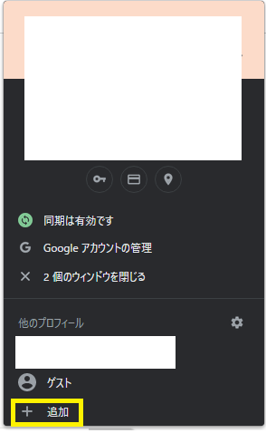
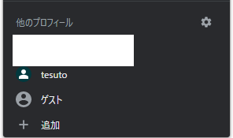
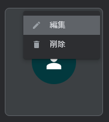
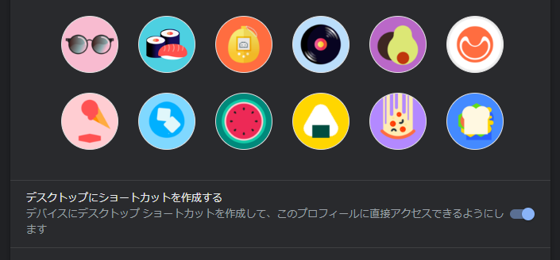

# Chrome

## サブアカウントを追加する

1. メインのアカウントでブラウザにログインする
1. アカウントのアイコンからメニューを開いて `追加` をクリック

    

## アカウントごとにショートカットを作成する

1. 歯車アイコンをクリック

    

1. 表示されたメニューの中から対象のアカウントの `︙` メニューを開いて `編集` をクリック

    

1. スクロールすると `デスクトップにショートカットを作成する` という設定校もがあるのでオンにする

    

1. デスクトップに作成されたショートカットを `C:\Users\%USERNAME%\AppData\Roaming\Microsoft\Windows\Start Menu` に置くことで、スタートメニューの検索対象に登録できる