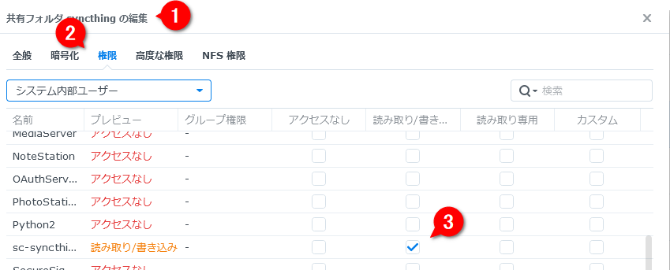
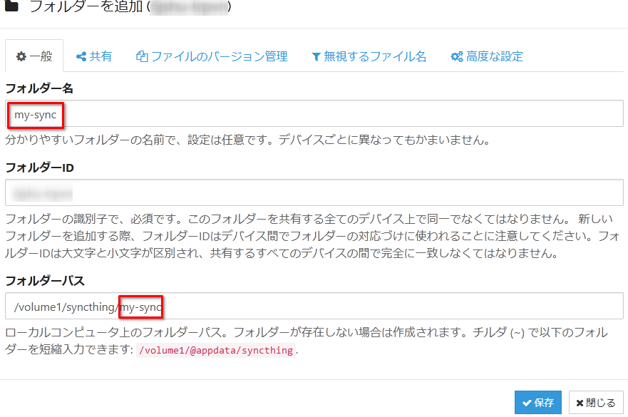

# Syncthing

基本的に以下の手順で進める。

1. 同期対象のフォルダのパスを指定する。
1. `無視するファイル` （`.stignore`）を設定する。
    - **必ずこの操作を先に行うこと！** 先に共有してしまうと無視すべきファイルも共有先の端末に残ってしまう。
1. `共有` から他の端末と同期する。


セキュリティのためにLAN内でのみ共有する方式にしてみる。

`設定` の `接続` から `NATトラバーサルを有効にする` と `グローバル探索` と `中継サーバー経由の通信を有効にする` をオフに。これで自宅のネットワークにあるときのみ同期するようになる。

## ローカル

### Default Folder

`.stignore`:

```
(?d)node_modules
keyhac.ini
cfiler.ini
tablacus/config/closedtabs*.xml
tablacus/config/window*.xml
(?d).venv
```


### Obsidian

Path: `~\Obsidian`

`.stignore`:

```
workspace.json
workspace-mobile.json
```

## Synology NAS

> [!NOTE]
> 転居などでネットワークそのものが変更された場合は、DSMのコントロールパネルから `ネットワーク` → `ネットワーク インターフェイス` で接続しているLANの編集画面を出し、 `DHCP サーバーのネットワーク設定を自動的に取得する` の設定を有効にすると基本的な初期設定を済ませてくれる。
> 
> これによってIPアドレスも変わるのでDSMからは一時的に強制ログアウトとなる。あらためて find.synology.com からDSMに再アクセスし、IPアドレスの固定操作を行う。


DSM にも Syncthing を追加する。

### 1. パッケージソースの追加

DSM 用の Syncthing は [SynoCommunity](https://synocommunity.com/) から提供されている。

公式のガイドに従って `SynoCommunity` という名前で `https://packages.synocommunity.com/` をパッケージソースに追加する。


### 2. パッケージのインストール

ソースを追加したので `Syncthing` と検索すればパッケージが見つかるはず。

インストールしたらセキュリティのためにユーザー名とパスワードを設定するように求められるので入力する。このときに指定するのは DSM のユーザー名・パスワードと同じである必要はない。

### 4. 同期用のフォルダ作成

コントロールパネルから共有フォルダを作成。


### 3. 権限の設定

読み書きできるように `システム内部ユーザー` から `sc-syncthing` を選んで権限を設定する。



ローカルユーザーは特に権限を設定しなくても問題ない様子。

この設定をしないと、後述の Syncthing 設定画面で `~~~~ permission denied` というエラーが出てしまう。


### 4. Syncthing の設定

最初に左上のメニューからデフォルト値を設定する。


`フォルダーのデフォルトの編集` をクリック。


`フォルダー名` は任意。重要なのは `フォルダーパス` で、上記で作成した共有フォルダへのパスを指定する。

`/volume1` をルートとして、この場合は直下に `syncthing` フォルダを作成したので `/volume1/syncthing` と指定する（パス区切りは Windows であってもスラッシュを使用する）。


図にあるように、デフォルトだと `@appdata` という隠しフォルダ内に共有フォルダを作る設定になっている。この隠しフォルダは DSM からは見えないので権限も設定できずエラーになる。忘れがちなので注意。


### 5. 同期用のフォルダ作成

上記の設定がうまくいっていれば、 `フォルダー名` で指定した内容が `フォルダーパス` にも自動的に反映されるはず。

