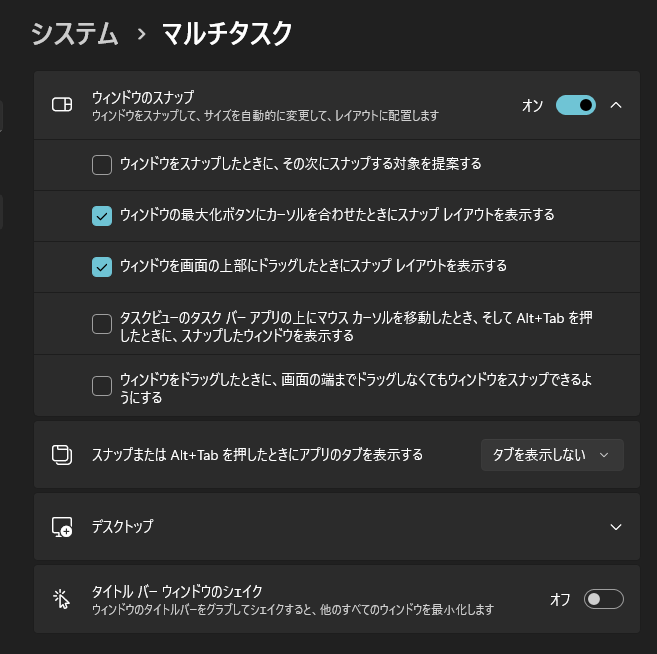
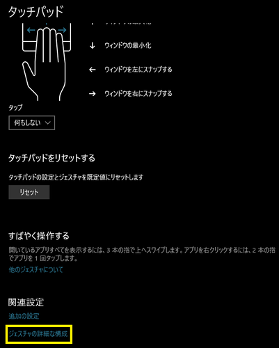
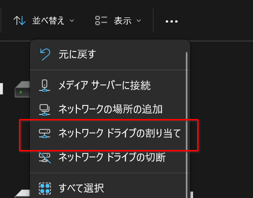
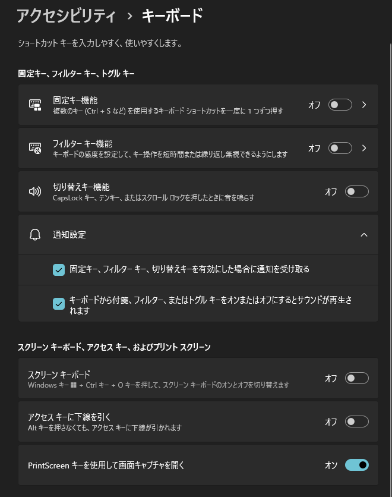

# Windows システム設定

## 既定の IME を設定

### Windows 11

`時刻と言語 > 日付と時刻` メニュー内の「日本語」の三点リーダオプションから `言語のオプション`

「キーボード」の `キーボードの追加` から `CorvusSKK` を追加

`時刻と言語 > 入力 > キーボードの詳細設定` でCorvusSKK を選択できるようになる。

### Windows 10

## <kbd>ctrl + alt + ←↓↑→</kbd> での画面回転の無効化

インテル グラフィックス・コマンド・センターの `システム` から `システムホットキーを有効にする` の設定をオフにする。

## 自動再生オフ

## マルチタスク

`ウィンドウのスナップ` をオンに。残りのチェックは外す。

<kbd>Alt + Tab</kbd> の切り替えを設定。

## タッチパッド設定

`タッチパッド` → `関連設定` → `ジェスチャの詳細な構成` をクリックして設定。

+ 3本指
    + タップ： `マウスの中央ボタン`
    + 上： `タスクビュー`
    + 下： `タスクビュー`
    + 左： `前方ナビゲーション`
    + 右： `後方ナビゲーション`
+ 4本指
    + タップ： `何もしない`
    + 上： `ウィンドウの最大化`
    + 下： `ウィンドウの最小化`
    + 左： `ウィンドウを左にスナップする`
    + 右： `ウィンドウを右にスナップする`

## ネットワークフォルダのドライブへの割り当て

エクスプローラーを開いて `コンピューター` メニューから `ネットワークドライブの割り当て` を選択。

ドライブレターの文字とパスを指定する。パスは `\\` から始めること。

## パフォーマンスオプション

+ `スクリーンフォントの縁を滑らかにする` と `アイコンの代わりに縮小版を表示する` 以外はオフでOK。
+ 必要であれば `ドラッグ中にウィンドウの内容を表示する` もオンに。

## キーボード設定変更キー（alt+shift）の無効化

## 固定キーの無効化

## 高DPI設定時の対応

`高 DPI スケール設定の上書き` で `システム（拡張）` を設定しておけばよい様子。

+ `アプリケーション` はアプリ自体の本来の描画で調整なしの状態
+ `システム` だとぼやけることがある

ただし MouseGestureL はここで `アプリケーション` を指定する（[公式](http://hp.vector.co.jp/authors/VA018351/mglahk.html)）。

> AutoHotkeyはPer-Monitor DPIに対応していないため、マルチモニター環境でプライマリモニターとは異なる表示スケールが設定されたモニター上では、カーソル座標に関連した不具合が発生します。 これを回避するには、以下の手順でAutoHotkeyに対する高DPI設定を変更する必要があります。
> 
>     1. エクスプローラーでAutoHotkey.exe（またはMouseGestureL.exe）のプロパティを表示する。
>     2. 「互換性」タブを選択し、「設定」の中の「高DPI設定の変更」ボタンをクリックする。
>     3. 「高DPIスケール設定の上書き」の中の「高DPIスケール設定の動作を上書きします。」をチェックする。
>     4. 「拡大縮小の実行元」ドロップダウンリストで「アプリケーション」を選択する。（デフォルトで選択されています）
>     5. 「OK」ボタンをクリックしてプロパティ画面を閉じる。
> 
> 上記の設定変更によりサブモニター上でのジェスチャー機能は正常動作するようになりますが、設定画面等のダイアログBOXをサブモニターへ移動した際に、表示スケールに応じたウィンドウサイズの自動調節が行われなくなります。

